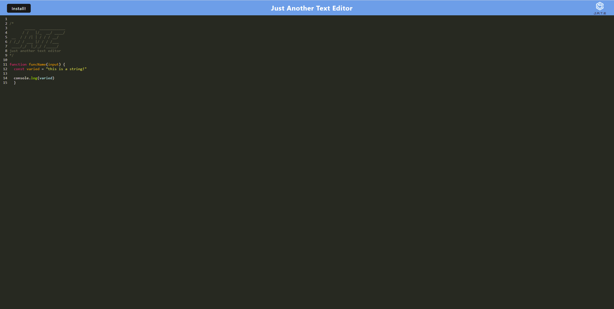

# PWA Text Editor

## Table of Contents

1. [Project Description](#project-description)
2. [Installation](#installation)
3. [Screenshot](#screenshot)
4. [Contributing](#contributing)
5. [Tests](#tests)
6. [License](#license)
7. [Contact](#contact)

## Project Description

This is a branded text editor featuring offline editing capabilities and a variety of useful tools. It also has limited coloring rules to help you see what your code does at a glance, and functionality that allows the user to quit and come back to the editor as they wish thanks to the application's built-in data persistence.

## Installation

If using locally, run the command `npm i`. If using the online application, click the "Install" button.

## Screenshot

## Contributing

N/A

## Tests

N/A

## License

This project uses the [MIT License](https://opensource.org/licenses/MIT). Click on the link to learn more.

## Contact

Github: [github.com/djmarcy](https://github.com/djmarcy)  
Email: [dylan@dylanjmarcy.com](mailto:dylan@dylanjmarcy.com)
